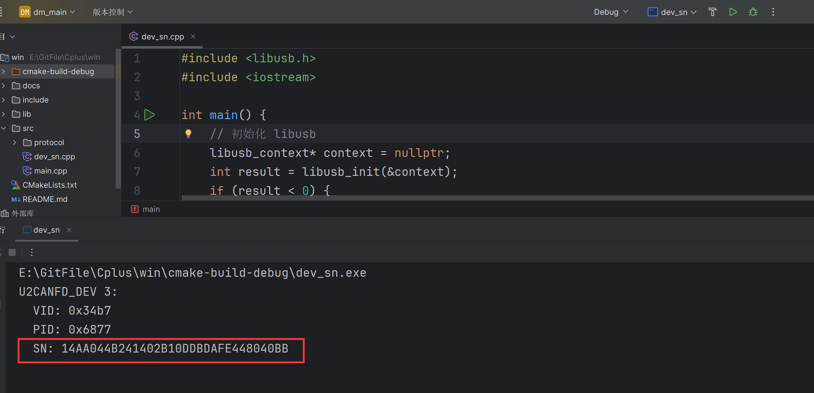

# 使用USB转CANFD驱动达妙电机，c++例程

## 介绍
这是控制达妙电机的c++例程。

硬件设备需要达妙的**USB转CANFD设备**。

程序测试环境是windows。

程序默认运行的效果是先让canid为0x01、mstid为0x11的DM4310电机控制模式设置为速度模式，然后使能，然后旋转，**电机波特率为5M**。

***注意：5M波特率下，电机有多个时，需要在末端电机接一个120欧的电阻***

## 软件架构
使用c++语言

## windows下的安装和编译
为便于从Unix-like的开发环境中迁移，我们使用MSYS，其中有类似于Ubuntu中apt的包管理器pacman
```shell
https://www.msys2.org/
```
下载对应的版本，然后傻瓜式安装，记住对应的安装路径，例如我安装在
```shell
E:\msys64
```
然后打开其中的 "msys2.exe"，接着
```shell
pacman -Syu
```
这个类似于 apt update，第一次之后 msys2 会重启，记得一路 y

然后我们再次打开，依次安装 工具链(gcc g++ make) 和 CMake
```shell
pacman -S --needed mingw-w64-x86_64-toolchain mingw-w64-x86_64-cmake 
```
继续，我们安装相应的依赖库，这里安装了 libusb-1.0，Boost 的 MSYS2/MinGW 包
```shell
pacman -Syu
pacman -S pkg-config
pacman -S --needed mingw-w64-x86_64-libusb
pacman -S --needed mingw-w64-x86_64-boost
```

接下来，我们以 CLion 为例配置编译器和调试环境；
```shell
找到 设置 >> 构建 执行 部署 >> 工具链

新建一个系统工具链 暂取名为 MSYS2
```
依次配置 CMake
```shell
E:\msys64\mingw64\bin\cmake.exe
```
配置构建工具
```shell
E:\msys64\mingw64\binlmingw32-make.exe
```
配置C编译器
```shell
E:\msys64\mingw64\bin\gcc.exe
```
配置C++编译器
```shell
E:\msys64\mingw64\bin\g++.exe
```
调试器
```shell
E:\msys64\mingw64\bin\gdb.exe
```
如下所示：


然后下载gitee上的工程，使用CLion打开，进行CMake预编译，并编译 Motor 和 dm_main，顺利的话即可通过编译

至此，环境配置完成，以后可以用 MSYS 的 pacman 进行包管理，使用 CLion 进行编译和调试了


## 简单使用

首先用最新上位机给电机设置5M波特率。

然后通过程序dev_sn.cpp找到**USB转CANFD设备**的Serial_Numbe,



上面图片里的SN后面的一串数字就是该设备的的Serial_Number，

接着复制该Serial\_Number，打开main.cpp，替换程序里的Serial\_Number,如下图所示：


然后重新编译，运行程序main.cpp，

此时你会发现电机亮绿灯，并且旋转

## 进阶使用

下面手把手教你怎么使用这个程序，实现功能是使用5M波特率，1kHz同时控制6个DM4310电机

***注意：windows下的sdk，当电机数量超过3个以上时，最好开多个线程分别调用发送控制命令函数***

***注意：5M波特率下，电机有多个时，需要在末端电机接一个120欧的电阻***

1. 首先用最新上位机给每个电机设置5M波特率。

2. 然后定义全局电机控制结构体：
```shell
std::shared_ptr<damiao::Motor_Control> control;
```

3.然后在main.cpp里定义全局id变量：
```shell
uint16_t canid1 = 0x01;
uint16_t mstid1 = 0x11;
uint16_t canid2 = 0x02;
uint16_t mstid2 = 0x12;
uint16_t canid3 = 0x03;
uint16_t mstid3 = 0x13;
uint16_t canid4 = 0x04;
uint16_t mstid4 = 0x14;
uint16_t canid5 = 0x05;
uint16_t mstid5 = 0x15;
uint16_t canid6 = 0x06;
uint16_t mstid6 = 0x16;
```
4. 然后定义USB转CANFD波特率：

```shell
uint32_t nom_baud =1000000;//仲裁域1M波特率
uint32_t dat_baud =5000000;//数据域5M波特率
```
5. 然后定义一个电机信息容器：
```shell
std::vector<damiao::DmActData> init_data;
```
6. 然后再用6个电机数据对该容器进行填充：
```shell
init_data.push_back(damiao::DmActData{.motorType = damiao::DM4310,
                                            .mode = damiao::MIT_MODE,
                                            .can_id=canid1,
                                            .mst_id=mstid1 });

init_data.push_back(damiao::DmActData{.motorType = damiao::DM4310,
        .mode = damiao::MIT_MODE,
        .can_id=canid2,
       .mst_id=mstid2 });

init_data.push_back(damiao::DmActData{.motorType = damiao::DM4310,
       .mode = damiao::MIT_MODE,
        .can_id=canid3,
        .mst_id=mstid3 });

init_data.push_back(damiao::DmActData{.motorType = damiao::DM4310,
        .mode = damiao::MIT_MODE,
        .can_id=canid4,
        .mst_id=mstid4 });
 
init_data.push_back(damiao::DmActData{.motorType = damiao::DM4310,
        .mode = damiao::MIT_MODE,
        .can_id=canid5,
        .mst_id=mstid5 });

init_data.push_back(damiao::DmActData{.motorType = damiao::DM4310,
        .mode = damiao::MIT_MODE,
        .can_id=canid6,
        .mst_id=mstid6 });
```
7. 然后初始化电机控制结构体：
```shell
std::shared_ptr<damiao::Motor_Control> control = std::make_shared<damiao::Motor_Control>(nom_baud,dat_baud,
      "AA96DF2EC013B46B1BE4613798544085",&init_data);
```
***注意：上面的"AA96DF2EC013B46B1BE4613798544085"是我设备的SN号，你要替换为你的SN号，通过运行dev_sn文件就可以找到你设备的SN号，前面也提到过***

8. 然后在main函数里的while(1)主循环上一行开一个线程：
```shell
std::thread t1(threadFunction, 1);
```

该线程函数定义如下，控制id4到6的电机。
```shell
void threadFunction(int id) {

  using clock = std::chrono::steady_clock;
  using duration = std::chrono::duration<double>;
  while (running) {
    const duration desired_duration(0.001); // 计算期望周期
    auto current_time = clock::now();

    control->control_mit(*control->getMotor(canid4), 0.0, 0.0, 0.0, 0.0, 0.0);
    control->control_mit(*control->getMotor(canid5), 0.0, 0.0, 0.0, 0.0, 0.0);
    control->control_mit(*control->getMotor(canid6), 0.0, 0.0, 0.0, 0.0, 0.0);

    const auto sleep_till = current_time + std::chrono::duration_cast<clock::duration>(desired_duration);
    std::this_thread::sleep_until(sleep_till);
  }
}
```

7. 接下来在main函数的while(1)里调用如下三个函数，控制id1到3的电机：
```shell
control->control_mit(*control->getMotor(canid1), 0.0, 0.0, 0.0, 0.0, 0.0);
control->control_mit(*control->getMotor(canid2), 0.0, 0.0, 0.0, 0.0, 0.0);
control->control_mit(*control->getMotor(canid3), 0.0, 0.0, 0.0, 0.0, 0.0);
```

8. 获取6个电机的位置、速度、力矩还有接收到电机反馈的数据的时间间隔：
```shell
for(uint16_t id = 1;id<=6;id++)
{
  float pos=control->getMotor(id)->Get_Position();//电机实际位置
  float vel=control->getMotor(id)->Get_Velocity();//电机实际速度
  float tau=control->getMotor(id)->Get_tau();//电机输出力矩
  double interval=control->getMotor(id)->getTimeInterval() ;//接收到电机反馈的数据的时间间隔
  std::cerr<<"canid is: "<<id<<" pos: "<<pos<<" vel: "<<vel
          <<" effort: "<<tau<<" time(s): "<<interval<<std::endl;
}
```
9. 1kHz的控制频率实现：

***注意：使用这函数std::this_thread::sleep_until(sleep_till)比较好***
```shell
while (1) 
{ 
  const duration desired_duration(0.001); // 计算期望周期
  auto current_time = clock::now();


  const auto sleep_till = current_time + std::chrono::duration_cast<clock::duration>(desired_duration);
  std::this_thread::sleep_until(sleep_till);    
}
```
## 接收函数说明

在damiao.cpp里的void Motor\_Control::canframeCallback(can\_value_type& value)，

这个函数是对接收到的can报文的解析，不能主动调用，他是作为参数传入到usb_class这个类，在usb\_class类里会开启线程调用该函数，

你可以重写这个函数解析自己的can报文数据
